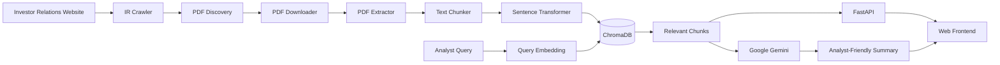
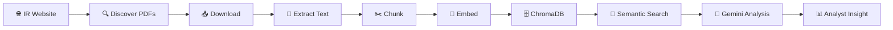

# 🧠 Investor Relations Intelligence Platform

<p align="center">
  <strong>Turn Investor Relations documents into searchable, analyst-ready intelligence.</strong>
</p>

<p align="center">
  
  
  
  
  
</p>

<p align="center">
  
  
  
  
</p>

---

## ✨ What is this?

**Investor Relations Intelligence Platform** is an AI-powered research application designed to help analysts find and understand company Investor Relations documents faster.

Instead of manually browsing IR websites, opening PDFs, reading long filings and searching through documents, the platform creates an intelligent pipeline:

> **Discover → Download → Extract → Chunk → Embed → Search → Summarize**

The current MVP has been tested end-to-end using **Page Industries** Investor Relations documents, including an investor/analyst meeting disclosure and an earnings-call notification.

---

## 🎯 Core Capabilities

| Capability | What it does |
|---|---|
| 🌐 **IR Web Crawling** | Discovers PDF links from Investor Relations pages |
| 📥 **PDF Downloading** | Downloads discovered documents automatically |
| 📄 **PDF Extraction** | Extracts text and page information from PDFs |
| ✂️ **Text Chunking** | Splits long documents into searchable chunks |
| 🧬 **Embeddings** | Converts text into semantic vector representations |
| 🔎 **Semantic Search** | Finds relevant content using natural-language queries |
| 🗄️ **Vector Storage** | Persists embeddings and metadata in ChromaDB |
| 🤖 **AI Summarization** | Uses Google Gemini to generate analyst-friendly summaries |
| ⚡ **FastAPI API** | Exposes search and summarization services |
| 🖥️ **Web Frontend** | Provides a clean research-oriented interface |

---

## 🏗️ System Architecture



---

## 🔄 Document Intelligence Pipeline



---

## 🧩 Project Structure

```text
Investor-Relations-Intelligence-Platform/
│
├── backend/
│   ├── app/
│   │   ├── ai/
│   │   │   ├── embedding_service.py
│   │   │   ├── semantic_search.py
│   │   │   ├── summary_service.py
│   │   │   ├── text_chunker.py
│   │   │   └── vector_store.py
│   │   │
│   │   ├── crawler/
│   │   ├── database/
│   │   ├── models/
│   │   ├── pdf/
│   │   ├── repositories/
│   │   ├── schemas/
│   │   ├── services/
│   │   ├── utils/
│   │   ├── config.py
│   │   └── main.py
│   │
│   ├── tests/
│   ├── requirements.txt
│   └── .env
│
├── frontend/
│   ├── index.html
│   ├── style.css
│   └── app.js
│
└── README.md
```

> `data/`, `venv/`, and `.env` are intentionally excluded from version control.

---

## 🧠 AI / RAG Flow

The semantic search component follows a lightweight Retrieval-Augmented Generation style workflow:

```text
                    OFFLINE / INGESTION
                           │
                           ▼
                    Investor PDF
                           │
                           ▼
                     Extract text
                           │
                           ▼
                       Chunk text
                           │
                           ▼
                 Sentence Transformer
                           │
                           ▼
                    Vector embeddings
                           │
                           ▼
                       ChromaDB
                           │
                           │
                    ONLINE / QUERY
                           │
                    Analyst question
                           │
                           ▼
                 Embed the question
                           │
                           ▼
              Similarity-based retrieval
                           │
                           ▼
                    Relevant chunks
                           │
                           ▼
                       Gemini AI
                           │
                           ▼
                 Analyst-ready summary
```

---

## 🔎 Example Semantic Search

**Query**

```text
investor analyst meeting June 2026
```

**Retrieved document**

```text
Investor_Meet_on_18_and_19_June_2026.pdf
Company: Page Industries
```

The retrieved content identifies:

- HSBC's Singapore conference
- 18–19 June 2026
- interaction with investors and analysts
- Page Industries management participation

This demonstrates that the system can retrieve relevant information even when the query is not an exact keyword match.

---

## 🤖 AI Summarization

The platform uses **Google Gemini** to convert retrieved investor-relations content into a concise analyst-oriented summary.

Example workflow:

```text
Retrieved IR Content
        │
        ▼
   Gemini Prompt
        │
        ▼
Structured analyst summary
        │
        ├── Purpose
        ├── Important dates
        ├── Business information
        ├── Management information
        └── Key takeaways
```

The Gemini API key is loaded from an environment variable and is **never committed to GitHub**.

---

## 🧪 Tested End-to-End

The current MVP has successfully demonstrated:

```text
                         TEST STATUS

IR PDF discovery             ████████████████████  ✅
PDF downloading              ████████████████████  ✅
PDF extraction               ████████████████████  ✅
Text chunking                ████████████████████  ✅
Embedding generation         ████████████████████  ✅
ChromaDB storage             ████████████████████  ✅
Semantic retrieval            ████████████████████  ✅
Gemini summarization          ████████████████████  ✅
FastAPI endpoints             ████████████████████  ✅
Frontend integration           ████████████████████  ✅
```

### Example ingestion result

```text
INGESTION COMPLETE

Company: Page Industries
Filename: Investor_Meet_on_18_and_19_June_2026.pdf
Pages: 1
Chunks: 2
```

---

## ⚙️ Local Setup

### 1. Clone the repository

```bash
git clone <YOUR_GITHUB_REPOSITORY_URL>
cd Investor-Relations-Intelligence-Platform
```

### 2. Create and activate the virtual environment

```powershell
cd backend
python -m venv venv
.\venv\Scripts\Activate.ps1
```

### 3. Install dependencies

```bash
pip install -r requirements.txt
```

### 4. Configure environment variables

Create:

```text
backend/.env
```

and add:

```env
GEMINI_API_KEY=your_api_key_here
```

Never commit this file.

### 5. Start the FastAPI backend

```bash
uvicorn app.main:app --reload
```

API:

```text
http://127.0.0.1:8000
```

Swagger:

```text
http://127.0.0.1:8000/docs
```

### 6. Start the frontend

Serve the `frontend/` directory using a local static server, then open the displayed local URL.

---

## 📡 Main API Operations

### Health check

```http
GET /health
```

### Semantic search

```http
POST /search
```

Example:

```json
{
  "query": "investor analyst meeting June 2026",
  "n_results": 3
}
```

### AI summarization

```http
POST /summarize
```

The endpoint accepts document text and returns an analyst-oriented Gemini-generated summary.

---

## 🛡️ Design Principles

### Separation of concerns

Each component has one primary responsibility:

```text
Crawler
   ↓
Downloader
   ↓
Extractor
   ↓
Chunker
   ↓
Embedding Service
   ↓
Vector Store
   ↓
Search Service
   ↓
Summary Service
```

For example, the PDF downloader does not need to know about SQLAlchemy or ChromaDB. This keeps the application modular and easier to test.

### Local generated data is not source code

The following are intentionally ignored by Git:

```text
data/
venv/
.env
*.db
*.sqlite3
```

This prevents local databases, vector indexes, downloaded PDFs and secrets from being committed.

---

## 🚀 Future Roadmap

### Phase 1 — MVP
- [x] IR PDF discovery
- [x] PDF download
- [x] Text extraction
- [x] Chunking
- [x] Embeddings
- [x] ChromaDB
- [x] Semantic search
- [x] Gemini summarization
- [x] FastAPI API
- [x] Web frontend

### Phase 2 — Productionization
- [ ] Automated multi-company ingestion
- [ ] Scheduled crawling
- [ ] Nifty 50 company configuration
- [ ] Background ingestion jobs
- [ ] Persistent production database
- [ ] Object storage for documents
- [ ] Authentication and user accounts

### Phase 3 — Financial Intelligence
- [ ] Financial KPI extraction
- [ ] Earnings trend analysis
- [ ] Management commentary extraction
- [ ] Event timeline generation
- [ ] Company comparison
- [ ] Alerts for new filings
- [ ] Analyst dashboards

---

## 🌟 Why this project?

Investor Relations information is often distributed across websites, filings, earnings-call documents and investor presentations.

This project demonstrates how modern AI engineering can transform that unstructured information into a searchable intelligence layer:

> **Unstructured documents → semantic retrieval → generative analysis → actionable insight**

---

## 📜 Disclaimer

This project is an educational/technical prototype. It is not financial advice and should not be used as the sole basis for investment decisions.

---

<p align="center">
  Built with ❤️ using FastAPI, Sentence Transformers, ChromaDB and Google Gemini.
</p>
